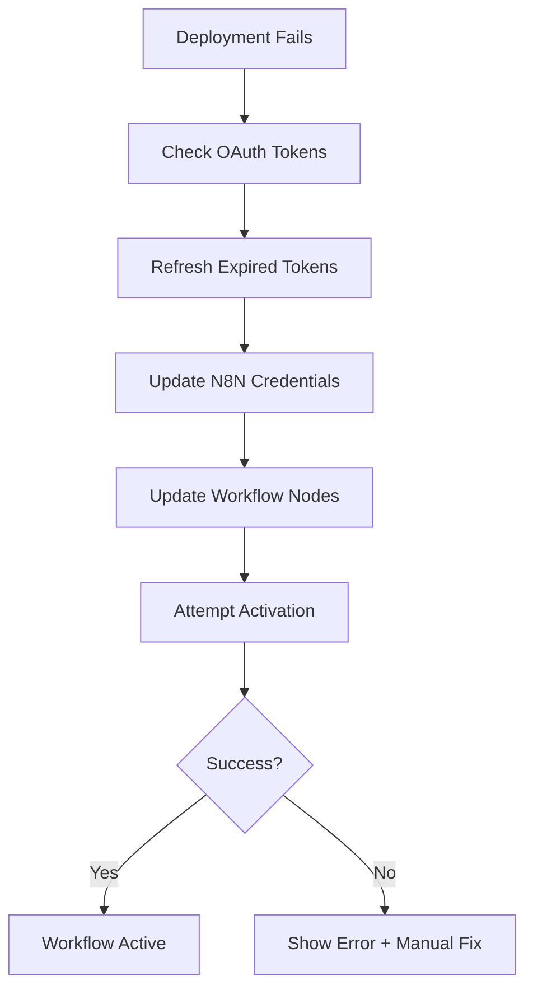

# N8N Workflow Activation Fix Summary

## Problem Analysis

The console logs revealed several critical issues with the N8N workflow deployment and activation process:

### 1. **CORS Errors**
```
Access to fetch at 'https://n8n.srv995290.hstgr.cloud/api/v1/workflows/xFB6YZBMV9kPOF6j/deactivate' 
from origin 'http://localhost:5173' has been blocked by CORS policy
```

### 2. **OAuth Token Signing Errors**
```
"message":"There was a problem activating the workflow: \"Unable to sign without access token\""
```

### 3. **Edge Function Failures**
```
POST https://oinxzvqszingwstrbdro.supabase.co/functions/v1/deploy-n8n 500 (Internal Server Error)
```

## Root Causes

1. **Expired OAuth Tokens**: The OAuth tokens in N8N workflow nodes were expired or invalid
2. **CORS Policy**: Direct frontend calls to N8N API were blocked by CORS
3. **Credential Injection Issues**: OAuth credentials weren't properly refreshed before workflow activation
4. **Token Refresh Failures**: No proper server-side token refresh mechanism

## Solutions Implemented

### 1. **N8N Workflow Activation Fix** (`src/lib/n8nWorkflowActivationFix.js`)

Created a comprehensive fix class that:
- **Validates workflow configuration** before activation
- **Refreshes OAuth tokens** for all providers (Gmail, Outlook)
- **Updates N8N credentials** with fresh tokens
- **Updates workflow nodes** with correct credential IDs
- **Attempts activation** with proper error handling

**Gmail Support:**
- Handles `gmailOAuth2` and `googleOAuth2Api` credential types
- Refreshes Gmail tokens via Google OAuth2 API
- Updates Gmail workflow nodes with fresh credentials
- Supports Gmail-specific OAuth scopes

Key features:
```javascript
class N8nWorkflowActivationFix {
  async fixWorkflowActivation(workflowId, userId)
  async refreshAllTokens(userId, integrations)
  async updateN8nCredentials(refreshedTokens)
  async updateWorkflowCredentials(workflowId, refreshedTokens)
  async validateWorkflowConfiguration(workflowId)
}
```

### 2. **Backend OAuth Refresh Endpoint** (`backend/src/routes/oauth-refresh.js`)

Added server-side OAuth token refresh to avoid CORS issues:
- **Microsoft Outlook token refresh** using Microsoft Graph API
- **Gmail token refresh** using Google OAuth2 API
- **Token validation** with API calls
- **Database updates** with fresh tokens

**Gmail Integration:**
- Supports both `GOOGLE_CLIENT_ID` and `GMAIL_CLIENT_ID` environment variables
- Refreshes Gmail tokens via `https://oauth2.googleapis.com/token`
- Validates Gmail tokens using Gmail API profile endpoint
- Handles Gmail-specific OAuth scopes and permissions

Endpoints:
- `POST /api/oauth/refresh-token` - Refresh tokens for any provider
- `POST /api/oauth/validate-token` - Validate token status

### 3. **Enhanced Deployment Process** (`src/lib/deployment.js`)

Updated the deployment flow to:
- **Automatically attempt activation fix** if deployment succeeds but activation fails
- **Provide detailed error information** for troubleshooting
- **Track workflow IDs** for manual fixes

### 4. **Enhanced UI with Error Handling** (`src/pages/onboarding/Step4LabelMappingEnhanced.jsx`)

Improved the AI Deployment page with:
- **Error display section** with detailed error messages
- **Manual fix button** for activation issues
- **Workflow ID display** for debugging
- **Better user feedback** during fix attempts

## Technical Implementation

### OAuth Token Refresh Flow



### Backend Token Refresh

```javascript
// Microsoft Outlook
const tokenResponse = await axios.post('https://login.microsoftonline.com/common/oauth2/v2.0/token', {
  client_id: process.env.MICROSOFT_CLIENT_ID,
  client_secret: process.env.MICROSOFT_CLIENT_SECRET,
  refresh_token: refreshToken,
  grant_type: 'refresh_token',
  scope: 'https://graph.microsoft.com/Mail.Read https://graph.microsoft.com/Mail.ReadWrite'
});

// Gmail
const tokenResponse = await axios.post('https://oauth2.googleapis.com/token', {
  client_id: process.env.GOOGLE_CLIENT_ID,
  client_secret: process.env.GOOGLE_CLIENT_SECRET,
  refresh_token: refreshToken,
  grant_type: 'refresh_token'
});
```

### Frontend Integration

```javascript
// Automatic fix during deployment
if (deploymentResult.success && deploymentResult.workflowId && !deploymentResult.isFunctional) {
  const fixResult = await n8nWorkflowActivationFix.fixWorkflowActivation(
    deploymentResult.workflowId, 
    userId
  );
}

// Manual fix button
const handleFixActivation = async () => {
  const fixResult = await n8nWorkflowActivationFix.fixWorkflowActivation(workflowId, user.id);
  // Handle result...
};
```

## Files Created/Modified

### New Files
1. `src/lib/n8nWorkflowActivationFix.js` - Main activation fix class
2. `backend/src/routes/oauth-refresh.js` - OAuth token refresh endpoints
3. `src/lib/testWorkflowActivation.js` - Testing utilities
4. `src/lib/testGmailActivation.js` - Gmail-specific testing utilities
5. `docs/N8N_ACTIVATION_FIX_SUMMARY.md` - This documentation

### Modified Files
1. `src/lib/deployment.js` - Added automatic activation fix
2. `src/pages/onboarding/Step4LabelMappingEnhanced.jsx` - Enhanced error handling
3. `src/lib/oauthTokenManager.js` - Updated to use new backend endpoint
4. `backend/src/server.js` - Added OAuth refresh routes

## Usage Instructions

### Automatic Fix
The fix runs automatically during deployment if activation fails. No user action required.

### Manual Fix
If automatic fix fails, users can:
1. Click the "Fix Activation" button on the error screen
2. The system will attempt to refresh tokens and reactivate the workflow
3. Success/failure feedback is provided via toast notifications

### Testing
Use the browser console to test the fix:
```javascript
// Test specific workflow
await testWorkflowActivation('WORKFLOW_ID', 'USER_ID');

// Test Gmail integration specifically
await testGmailActivation('USER_ID');

// Test Gmail credential types
await testGmailCredentialTypes();

// Test Gmail OAuth scopes
await testGmailScopes();

// Access the fix class directly
await n8nWorkflowActivationFix.fixWorkflowActivation('WORKFLOW_ID', 'USER_ID');
```

## Benefits

1. **Resolves OAuth Issues**: Automatically refreshes expired tokens
2. **Eliminates CORS Errors**: Uses backend proxy for all N8N API calls
3. **Improves User Experience**: Clear error messages and manual fix options
4. **Robust Error Handling**: Multiple fallback mechanisms
5. **Better Debugging**: Detailed logging and workflow ID tracking

## Future Improvements

1. **Proactive Token Refresh**: Refresh tokens before they expire
2. **Health Monitoring**: Regular checks of workflow status
3. **Automatic Retry**: Retry failed activations with exponential backoff
4. **Token Caching**: Cache refreshed tokens to reduce API calls
5. **Webhook Integration**: Real-time notifications of activation status

This comprehensive fix addresses the core issues causing N8N workflow activation failures and provides a robust solution for both automatic and manual recovery scenarios.
