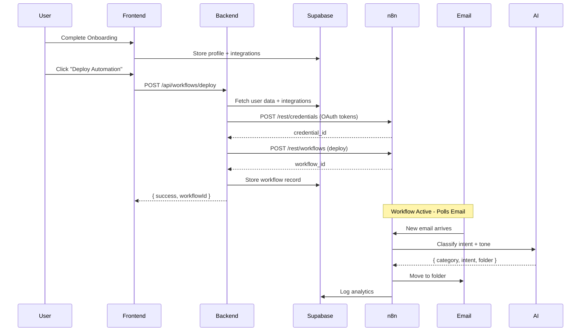

# FloworxV2 Architecture Governance Blueprint

> **📍 Source of Truth**: The authoritative version of this document lives in `/ARCHITECTURE_GOVERNANCE.md` on the `main` branch. All team members must reference this version.

## 🎯 Purpose

This document defines the **frozen contracts**, **ownership boundaries**, and **change management process** for FloworxV2 to prevent architectural drift and enable safe, parallel development.

**Last Updated**: 2025-10-07  
**Next Review**: 2025-11-07  
**Document Owner**: Architecture Team Lead  
**Status**: ✅ Active & Enforced

---

## 🔒 1. Frozen Core Contracts

### 🗃️ **Supabase Schema Contracts**

**FROZEN - Changes require RFC + migration script**

#### Core Tables
```sql
-- profiles (User identity & onboarding state)
  id UUID PK
  email TEXT
  onboarding_step TEXT
  client_config JSONB
  
-- integrations (OAuth connections)
  id UUID PK
  user_id UUID FK
  provider TEXT ('gmail' | 'outlook')
  access_token TEXT
  refresh_token TEXT
  n8n_credential_id TEXT  -- Maps to n8n credential
  status TEXT
  
-- business_labels (Email folder/label mappings)
  id UUID PK
  user_id UUID FK
  provider TEXT
  label_id TEXT  -- Provider's ID (Gmail: Label_123, Outlook: AAMkAD...)
  label_name TEXT
  category TEXT  -- Sales, Support, Operations, etc.
  intent TEXT    -- consultation, invoice, repair, etc.
  path TEXT      -- Full hierarchical path
  parent_id TEXT -- For nested folders
  
-- workflows (n8n workflow deployments)
  id UUID PK
  client_id UUID FK
  n8n_workflow_id TEXT
  version INTEGER
  status TEXT
  deployed_at TIMESTAMP
```

**Contract Promise**: Column names, types, and relationships will not change without migration.

---

### ⚙️ **n8n Workflow Contracts**

**FROZEN - Workflow input/output structure**

#### Webhook Payload Shape
```json
{
  "userId": "uuid",
  "provider": "gmail|outlook",
  "emailData": {
    "from": "email@domain.com",
    "subject": "...",
    "body": "...",
    "messageId": "..."
  }
}
```

#### Label Generator Node Output
```json
{
  "provider": "outlook",
  "labels": {
    "SALES_CONSULTATION": "folder-id-123",
    "SERVICE_REPAIRS": "folder-id-456",
    "BANKING_INVOICE": "folder-id-789"
  }
}
```

#### AI Classifier Output
```json
{
  "intent": "consultation|invoice|repair|...",
  "category": "Sales|Support|Operations|...",
  "confidence": 0.95,
  "folder": "SALES_CONSULTATION"
}
```

**Contract Promise**: These JSON shapes remain stable across workflow versions.

**Security Boundary**: All Supabase tables enforce Row Level Security (RLS):
```sql
CREATE POLICY "Users can only access own rows"
  ON public.business_labels 
  USING (user_id = auth.uid());

CREATE POLICY "Users can only access own integrations"
  ON public.integrations 
  USING (user_id = auth.uid());
```

---

### 💻 **Backend API Contracts**

**FROZEN - Endpoint paths and JSON structure**

#### POST /api/workflows/deploy
```javascript
// Request
{
  userId: "uuid",
  workflowData: {
    name: "Business Name",
    businessType: "Pools & Spas"
  },
  deployToN8n: true,
  useCapturedData: true
}

// Response
{
  success: true,
  workflowId: "n8n-workflow-id",
  version: 16,
  message: "Deployment successful"
}
```

#### n8n REST API (via CORS Proxy)
```javascript
// Endpoint: /rest/credentials
POST /rest/credentials
{
  name: "Business Gmail",
  type: "gmailOAuth2Api",
  data: { access_token, refresh_token, clientId, clientSecret },
  nodesAccess: [{ nodeType: "n8n-nodes-base.gmail" }]
}

// Endpoint: /rest/workflows/{id}/activate
POST /rest/workflows/{id}/activate
// Body: {} (empty)
```

**Contract Promise**: Endpoint paths and required fields remain stable.

---

### 🧠 **AI Integration Contracts**

**FROZEN - Model input/output schema**

#### Intent Classification Input
```json
{
  "emailContent": "...",
  "subject": "...",
  "from": "email@domain.com",
  "businessType": "Pools & Spas"
}
```

#### Intent Classification Output
```json
{
  "primary_category": "Service",
  "intent": "repairs",
  "confidence": 0.92,
  "suggested_folder": "SERVICE_REPAIRS",
  "tone": "urgent"
}
```

**Contract Promise**: Input fields and output structure remain stable for n8n integration.

---

## 🧩 2. System Architecture (Source of Truth)

### High-Level Flow

```
┌──────────────────────────────────────────────────────────────────┐
│  USER JOURNEY: Onboarding → Email Integration → Workflow Deploy │
└────────────────────────┬─────────────────────────────────────────┘
                         │
        ┌────────────────┴────────────────┐
        │                                 │
   ┌────▼────┐                      ┌────▼─────┐
   │ FRONTEND│                      │ BACKEND  │
   │ (Vite)  │───── POST /api ─────→│ (Node.js)│
   └────┬────┘                      └────┬─────┘
        │                                │
        │                    ┌───────────┼──────────┐
        │                    │           │          │
    ┌───▼────┐          ┌───▼────┐ ┌───▼───┐ ┌───▼────┐
    │Supabase│          │  n8n   │ │ Gmail │ │Outlook │
    │  DB    │◄─────────┤Workflows│ │  API  │ │  API   │
    └────────┘          └───┬────┘ └───────┘ └────────┘
                            │
                        ┌───▼────┐
                        │ OpenAI │
                        │   API  │
                        └────────┘
```

### Component Registry

| Component | Technology | Port/URL | Purpose |
|-----------|-----------|----------|---------|
| Frontend | React + Vite | :5173 | User onboarding, deployment UI |
| Backend API | Node.js + Express | :3001 | n8n deployment, data aggregation |
| Main API | Node.js | :3000 | OpenAI proxy, analytics |
| Supabase | PostgreSQL + Edge Functions | supabase.co | Data storage, auth, CORS proxy |
| n8n | Workflow automation | n8n.srv995290.hstgr.cloud | Email processing, AI routing |

---

## 📦 3. Module Ownership

| Module | Owner Role | Scope | Frozen Contracts |
|--------|-----------|-------|------------------|
| **Frontend** | Frontend Dev | - Onboarding flows<br>- Deployment UI<br>- OAuth callback handling | - `onboarding_step` values<br>- API request shapes |
| **Backend API** | Backend Lead | - `/api/workflows/deploy`<br>- Data aggregation<br>- n8n deployment | - API endpoints<br>- Response JSON structure |
| **Supabase Schema** | Database Admin | - Table structure<br>- RLS policies<br>- Migrations | - Table/column names<br>- FK relationships |
| **n8n Workflows** | Automation Engineer | - Workflow templates<br>- Node configurations<br>- Label provisioning | - Webhook payload shape<br>- Label Generator output |
| **AI Layer** | AI/ML Dev | - OpenAI integration<br>- Intent classification<br>- Voice analysis | - Classifier input/output<br>- Intent taxonomy |
| **Email Integration** | Integration Dev | - Gmail/Outlook APIs<br>- Label sync service<br>- Token management | - Label schema<br>- Sync payload format |

**Rule**: You can modify code **within** your module, but cross-module changes require an RFC.

---

## 🔄 4. Change Proposal Process (RFC)

### When RFC is Required

- ✅ Changing API endpoint paths or parameters
- ✅ Adding/removing database columns
- ✅ Modifying n8n webhook payload structure
- ✅ Changing AI classifier output format
- ✅ Updating label/folder hierarchy

### When RFC is NOT Required

- ❌ UI styling changes
- ❌ Internal function refactoring
- ❌ Adding logging/debugging
- ❌ Performance optimizations (that don't change contracts)

### RFC Template

```markdown
## RFC: [Short Title]

**Author**: [Your Name]
**Date**: 2025-10-07
**Status**: Proposed | Approved | Implemented | Rejected

### Problem
What issue are we solving?

### Proposed Change
What exactly will change?

### Affected Components
- [ ] Frontend
- [ ] Backend API
- [ ] Supabase Schema
- [ ] n8n Workflows
- [ ] AI Layer

### Migration Plan
How will we migrate existing data/workflows?

### Rollback Plan
How can we revert if this breaks?

### Testing Checklist
- [ ] Local testing complete
- [ ] Staging environment tested
- [ ] No breaking changes to existing workflows
```

Save as: `docs/rfcs/YYYY-MM-DD-short-title.md`

---

## 📊 5. Module Versioning

### Current System Versions

```
FloworxV2 v2.4
├─ Frontend v0.9.0
├─ Backend API v1.2.0
├─ Database Schema v2025.10.07
├─ n8n Workflows v1.4
│  ├─ Pools & Spas Template v1.4.2
│  ├─ HVAC Template v1.3.1
│  └─ Electrician Template v1.2.0
├─ AI Classifier v2.1
└─ Label Sync System v1.0
```

### Version Bumping Rules

- **Patch** (v1.0.0 → v1.0.1): Bug fixes, no contract changes
- **Minor** (v1.0.0 → v1.1.0): New features, backward compatible
- **Major** (v1.0.0 → v2.0.0): Breaking changes to contracts

**Track in**: `package.json`, `docs/versions.md`, database `system_version` table

---

## 🧪 6. Environment Strategy

### Environment Tiers

| Environment | Purpose | Data | URL |
|-------------|---------|------|-----|
| **Local** | Feature development | Fake/test data | localhost:5173 |
| **Staging** | Integration testing | Sanitized copy of prod | staging.floworx-iq.com |
| **Production** | Live customers | Real data | app.floworx-iq.com |

### Deployment Gates

```
Local → Staging: Automatic on PR merge to `develop`
Staging → Production: Manual approval after QA sign-off
```

### Staging Tests Before Production

- ✅ n8n workflow activation works
- ✅ Gmail/Outlook OAuth flow completes
- ✅ AI classification accuracy > 85%
- ✅ Label provisioning creates correct folders
- ✅ No database migration errors

---

## 🗺️ 7. System Visualization

### Data Flow Diagram (Mermaid)



### Database ER Diagram

```
profiles 1──→ * integrations
profiles 1──→ * workflows
profiles 1──→ * business_labels
integrations 1──→ * business_labels (via user_id)
```

---

## 📋 8. Golden Path Documentation

### **"What Happens When a User Clicks Deploy?"**

1. **Frontend** (`src/lib/deployment.js`)
   - Calls `deployAutomation(userId)`
   - Shows deployment progress UI

2. **Workflow Deployer** (`src/lib/workflowDeployer.js`)
   - **Step 1**: Create n8n credentials via `n8nCredentialCreator`
     - Endpoint: `POST /rest/credentials`
     - Fetches `access_token`, `refresh_token` from `integrations` table
     - Creates credential in n8n
     - Saves `n8n_credential_id` back to `integrations` table
   
   - **Step 2**: Run pre-deployment validation
     - Checks n8n health
     - Validates database readiness
   
   - **Step 3**: Deploy workflow via backend API
     - `POST /api/workflows/deploy`
     - Backend fetches all user data from Supabase
     - Backend builds n8n workflow JSON
     - Backend deploys to n8n via `POST /rest/workflows`
   
   - **Step 4**: Activate workflow
     - `POST /rest/workflows/{id}/activate`
     - Workflow starts polling email

3. **Supabase** (Data persistence)
   - Stores workflow record in `workflows` table
   - Updates `profiles.onboarding_step = 'completed'`

4. **n8n** (Automation execution)
   - Workflow polls Gmail/Outlook every 2 minutes
   - On new email → sends to AI classifier
   - Moves email to appropriate folder based on intent
   - Logs analytics to Supabase

**Everyone on the team should memorize this flow.**

---

## 🧱 9. System Contracts Manifest

### API Contracts

#### `POST /api/workflows/deploy`
```typescript
interface DeployRequest {
  userId: string;
  workflowData: {
    name: string;
    businessType?: string;
  };
  deployToN8n: boolean;
  useCapturedData: boolean;
}

interface DeployResponse {
  success: boolean;
  workflowId: string;
  version: number;
  message?: string;
}
```

#### `POST /rest/credentials` (n8n)
```typescript
interface CredentialPayload {
  name: string;
  type: "gmailOAuth2Api" | "microsoftOutlookOAuth2Api";
  data: {
    access_token: string;
    refresh_token: string;
    token_type: "Bearer";
    clientId: string;
    clientSecret: string;
  };
  nodesAccess: Array<{ nodeType: string }>;
}
```

### Database Contracts

#### Onboarding Steps (enum)
```
'email_integration' → 'business_type' → 'business_information' → 
'team_setup' → 'deploy' → 'completed'
```

#### Provider Values (enum)
```
'gmail' | 'outlook'
```

#### Label Categories (enum)
```
'Sales' | 'Support' | 'Operations' | 'Banking' | 'Marketing' | 'HR' | 'Admin'
```

### n8n Workflow Node IDs (stable references)

```
'Label Generator' - Outputs folder ID mappings
'AI Classifier' - Classifies email intent
'Gmail Trigger' / 'Outlook Trigger' - Polls for emails
'Category Switch' - Routes based on intent
```

**Contract Promise**: Node IDs remain stable for expression references.

---

## 🔢 10. Version Control

### Semantic Versioning

```
MAJOR.MINOR.PATCH
 │     │     └─ Bug fixes, no API changes
 │     └─ New features, backward compatible
 └─ Breaking changes to contracts
```

### Current Versions

```yaml
system:
  version: "2.4.0"
  
modules:
  frontend:
    version: "0.9.0"
    last_updated: "2025-10-07"
    
  backend:
    version: "1.2.0"
    last_updated: "2025-10-07"
    
  database:
    schema_version: "2025.10.07"
    migration: "add-n8n-credential-columns"
    
  n8n_workflows:
    version: "1.4.2"
    templates:
      pools_spas: "1.4.2"
      hvac: "1.3.1"
      electrician: "1.2.0"
      
  ai_classifier:
    version: "2.1.0"
    model: "gpt-4"
    intent_taxonomy_version: "1.0"
    
  label_sync:
    version: "1.0.0"
    last_updated: "2025-10-07"
```

**Track in**: `docs/versions.md` (update on each release)

---

## 📐 11. Change Management Process

### Workflow for Making Changes

```
┌─────────────────────────────────────────┐
│ 1. Identify needed change               │
│    ↓                                     │
│ 2. Check: Does it affect contracts?     │
│    ├─ NO → Proceed with implementation  │
│    └─ YES → Continue to Step 3          │
│    ↓                                     │
│ 3. Create RFC in docs/rfcs/             │
│    ↓                                     │
│ 4. Post in #architecture-changes channel│
│    ↓                                     │
│ 5. Team review (24-48 hour window)      │
│    ↓                                     │
│ 6. Approval → Update docs first         │
│    ↓                                     │
│ 7. Implement with migration script      │
│    ↓                                     │
│ 8. Test in staging                       │
│    ↓                                     │
│ 9. Deploy to production                 │
│    ↓                                     │
│10. Update version numbers                │
└─────────────────────────────────────────┘
```

### Example: Adding a New Label Category

**❌ Wrong Way**:
```javascript
// Just add it directly to code
const categories = ['Sales', 'Support', 'NewCategory'];
```

**✅ Right Way**:
1. Create RFC: `docs/rfcs/2025-10-07-add-newcategory-label.md`
2. Document impact:
   - Supabase: Add enum value to `category` column
   - n8n: Update Label Generator node
   - AI: Retrain classifier with new category
3. Create migration: `migrations/2025_10_07_01_add_newcategory.sql`
4. Test in staging
5. Deploy with version bump

---

## 🛡️ 12. Architecture Review Checklist

Before merging any PR that touches core systems, verify:

- [ ] Does this change any **frozen contracts**?
- [ ] If yes, is there an **RFC** approved?
- [ ] Is there a **database migration** script?
- [ ] Are **all environments** (local, staging, prod) tested?
- [ ] Is the **architecture doc** updated?
- [ ] Are **version numbers** bumped appropriately?
- [ ] Is there a **rollback plan** documented?
- [ ] Have **dependent modules** been notified?

---

## 📚 13. Documentation Structure

```
FloworxV2/
├─ docs/
│  ├─ architecture.md           ← YOU ARE HERE (source of truth)
│  ├─ versions.md               ← Current version registry
│  ├─ golden-path.md            ← Step-by-step flow diagrams
│  ├─ contracts.md              ← API & schema contracts
│  ├─ rfcs/                     ← Change proposals
│  │  ├─ 2025-10-07-add-label-hierarchy.md
│  │  └─ 2025-10-06-unified-folder-structure.md
│  └─ generated/                ← Auto-generated docs
│     ├─ database-er.svg
│     ├─ workflow-list.json
│     └─ api-endpoints.md
│
├─ migrations/                  ← Database migrations (timestamped)
│  ├─ 2025_10_07_01_add_n8n_credential_columns.sql
│  └─ 2025_10_07_02_add_label_hierarchy.sql
│
├─ src/                         ← Application code
│  ├─ lib/                      ← Core services
│  │  ├─ n8nCredentialCreator.js
│  │  ├─ workflowDeployer.js
│  │  └─ labelSyncService.js
│  └─ pages/                    ← UI components
│
└─ backend/                     ← Backend services
   └─ src/
      └─ server.js              ← API endpoints
```

---

## 🚦 14. Communication Cadence

### Weekly Architecture Sync (30 min, every Monday)

**Agenda**:
1. Review any RFCs submitted last week
2. Discuss upcoming changes
3. Surface any integration issues
4. Update architecture doc if needed

**Participants**: One representative from each module (Frontend, Backend, AI, n8n)

### Slack/Discord Channels

- `#architecture-changes` - Post RFCs and major changes
- `#deployments` - Notify on staging/prod deployments
- `#incidents` - Report breaking changes or rollbacks

### Documentation Updates

- **Before code change**: Update docs/rfcs/
- **After deployment**: Update docs/versions.md
- **Weekly**: Regenerate docs/generated/

---

## 🧰 15. Tools & Automation

### Required Environment Variables

**ALL environments must have these configured:**

```env
# Supabase
VITE_SUPABASE_URL=https://oinxzvqszingwstrbdro.supabase.co
VITE_SUPABASE_ANON_KEY=eyJhbGc...
SUPABASE_SERVICE_ROLE_KEY=eyJhbGc...

# n8n
VITE_N8N_BASE_URL=https://n8n.srv995290.hstgr.cloud
VITE_N8N_API_KEY=eyJhbGc...
N8N_API_KEY=eyJhbGc...  # Backend

# OAuth Providers
VITE_GMAIL_CLIENT_ID=636568831348-...
VITE_GMAIL_CLIENT_SECRET=GOCSPX-...
VITE_OUTLOOK_CLIENT_ID=896fec20-...
VITE_OUTLOOK_CLIENT_SECRET=qWA8Q~...

# AI
OPENAI_API_KEY=sk-...

# Backend
VITE_BACKEND_URL=http://localhost:3001  # Local
# VITE_BACKEND_URL=https://api.floworx-iq.com  # Production
```

**Contract Promise**: These variable names are frozen. New services must use new variable names.

---

### Mandatory Tools

1. **Mermaid** - For flow diagrams in docs
   ```bash
   npm install -g @mermaid-js/mermaid-cli
   mmdc -i docs/architecture.mmd -o docs/architecture.svg
   ```

2. **dbdocs.io** or **dbdiagram.io** - For ER diagrams
   ```bash
   # Export Supabase schema
   supabase db dump --schema public > docs/generated/schema.sql
   ```

3. **n8n API Scripts** - For workflow inventory
   ```javascript
   // scripts/sync-n8n-docs.js
   const workflows = await fetch('/rest/workflows', {
     headers: { 'X-N8N-API-KEY': process.env.N8N_API_KEY }
   });
   fs.writeFileSync('docs/generated/workflow-list.json', JSON.stringify(workflows, null, 2));
   ```

### CI/CD Contract Validation

**Mandatory GitHub Action** - Runs on all PRs:

```yaml
# .github/workflows/validate-contracts.yml
name: Validate Architecture Contracts

on:
  pull_request:
    branches: [main, develop]

jobs:
  validate:
    runs-on: ubuntu-latest
    steps:
      - uses: actions/checkout@v3
      
      - name: Check for contract changes
        run: |
          git diff origin/main -- \
            "migrations/*.sql" \
            "src/lib/*Deployer.js" \
            "src/lib/n8n*" \
            "supabase/migrations/*.sql"
      
      - name: Validate Architecture Contracts
        run: npm run validate-contracts
        
      - name: Check for RFC if contracts changed
        run: |
          if git diff --name-only origin/main | grep -E "(migrations|contracts)"; then
            if [ ! -f docs/rfcs/$(date +%Y-%m-%d)*.md ]; then
              echo "❌ Contract changes detected but no RFC found"
              exit 1
            fi
          fi
```

### GitHub Actions (Optional)

```yaml
# .github/workflows/docs-sync.yml
name: Sync Architecture Docs
on:
  push:
    branches: [main, develop]
jobs:
  sync:
    runs-on: ubuntu-latest
    steps:
      - uses: actions/checkout@v3
      - run: npm run generate-docs
      - run: npm run validate-contracts
```

---

## 🔐 16. Governance Rules

### Golden Rules

1. **No Silent Changes** - If it touches a contract, create an RFC
2. **Docs First** - Update documentation before code
3. **Version Everything** - Track versions in `versions.md`
4. **Test in Staging** - No direct-to-production deploys
5. **One Source of Truth** - This doc (`ARCHITECTURE_GOVERNANCE.md`) is authoritative

### Emergency Hotfix Exception

If production is down:
1. Deploy hotfix immediately
2. Create RFC **after** deployment
3. Document in incident report
4. Schedule proper fix with RFC process

---

## 📖 17. Onboarding New Developers

### Required Reading (in order)

1. `docs/ARCHITECTURE_GOVERNANCE.md` ← This doc
2. `docs/golden-path.md` ← User journey flow
3. `docs/contracts.md` ← API & schema contracts
4. `README.md` ← Setup instructions

### Mandatory Setup

1. Review architecture diagram
2. Run system locally
3. Deploy test workflow to staging
4. Read last 5 RFCs to understand recent changes

**Rule**: No code contributions until they can explain the golden path.

---

## 🔄 18. Migration & Rollback Standards

### Database Migration Format

```sql
-- migrations/2025_10_07_01_add_n8n_credential_columns.sql

-- Description: Add n8n credential mapping to integrations table
-- Author: AI Assistant
-- Date: 2025-10-07
-- Affects: integrations table
-- Rollback: migrations/2025_10_07_01_rollback.sql

BEGIN;

ALTER TABLE public.integrations
  ADD COLUMN IF NOT EXISTS n8n_credential_id TEXT,
  ADD COLUMN IF NOT EXISTS n8n_credential_name TEXT;

CREATE INDEX IF NOT EXISTS idx_integrations_n8n_credential_id 
  ON public.integrations(n8n_credential_id);

COMMIT;
```

### Rollback Script (always create!)

```sql
-- migrations/2025_10_07_01_rollback.sql

BEGIN;

ALTER TABLE public.integrations
  DROP COLUMN IF EXISTS n8n_credential_id,
  DROP COLUMN IF EXISTS n8n_credential_name;

DROP INDEX IF EXISTS idx_integrations_n8n_credential_id;

COMMIT;
```

---

## 🎯 19. Current System State

### Active Integrations

- ✅ Gmail OAuth2 (client ID configured)
- ✅ Outlook OAuth2 (client ID configured)
- ✅ OpenAI GPT-4 (API key configured)
- ✅ Supabase PostgreSQL (connection stable)
- ✅ n8n Automation Platform (REST API accessible)

### Deployed Workflows

| Workflow ID | Version | Status | Created | User |
|-------------|---------|--------|---------|------|
| `VHNyC5ml6jkiEkSN` | 15 | Active | Recent | fedf818f... |
| `EfLQpviPzoQ0w2Fk` | 16 | Active | Latest | fedf818f... |

### Pending Migrations

- [ ] `add-n8n-credential-columns.sql` - Add credential mapping to integrations
- [ ] `add-intent-based-columns.sql` - Add category/intent to business_labels

---

## ✅ 20. Compliance Checklist

Use this before every major release:

### Pre-Deployment

- [ ] All RFCs approved and documented
- [ ] Database migrations tested in staging
- [ ] n8n workflows activated successfully in staging
- [ ] AI classification accuracy validated
- [ ] OAuth flows tested (Gmail + Outlook)
- [ ] Rollback scripts prepared
- [ ] Architecture doc updated
- [ ] Version numbers bumped

### Post-Deployment

- [ ] Verify all workflows active in production
- [ ] Check Supabase logs for errors
- [ ] Monitor n8n execution logs
- [ ] Validate user onboarding flow
- [ ] Update `docs/versions.md`
- [ ] Create deployment summary

---

## 📞 21. Escalation Path

If you encounter:

| Issue | Action | Contact |
|-------|--------|---------|
| Contract conflict | Pause deployment, create RFC | Architecture team |
| Data migration failure | Rollback immediately | Database admin |
| n8n workflow broken | Deactivate workflow, investigate | Automation engineer |
| Production outage | Hotfix exception process | All hands |
| Unclear ownership | Check this doc's Module Ownership table | Team lead |

---

## 🚀 Quick Reference

### Making a Change?

1. **Check**: Does it affect contracts? (See section 1)
2. **If YES**: Create RFC (See section 4)
3. **If NO**: Proceed with development

### Deploying?

1. **Local** → Test
2. **Staging** → Validate
3. **Production** → Monitor

### Confused?

1. Read **Golden Path** (section 8)
2. Check **Contracts Manifest** (section 9)
3. Ask in `#architecture-changes`

---

## 📝 Maintenance

**This document is reviewed**: 
- After every major release
- Monthly architecture sync
- When onboarding new team members

**Last Updated**: 2025-10-07  
**Next Review**: 2025-11-07  
**Document Owner**: Architecture Team Lead

---

**Remember**: This doc exists to **enable fast, safe development** - not to slow you down. When in doubt, create an RFC and get team alignment. It takes 30 minutes and saves days of rework.

