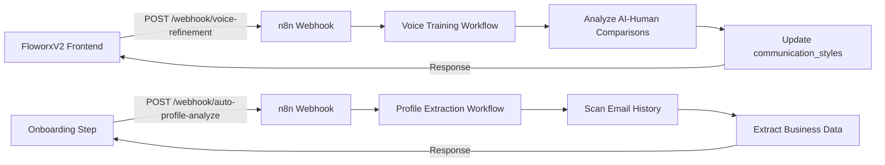

# FloworxV2 ↔ n8n Webhook Integration Guide

## Overview

FloworxV2 requires **2 webhooks** to fully integrate with n8n workflows for the complete 3-Layer Schema System and Voice Training functionality.

---

## 🔴 **Required Webhooks**

### **1. Voice Training Refinement Webhook**

**Purpose**: Triggers voice profile refinement when enough AI-Human comparisons are collected.

**Webhook URL**: `https://n8n.srv995290.hstgr.cloud/webhook/voice-refinement`

**Method**: `POST`

**Payload**:
```json
{
  "userId": "user-uuid-here",
  "trigger": "manual" | "automatic",
  "timestamp": "2025-10-08T21:00:00.000Z"
}
```

**Triggered By**:
- `src/lib/voicePromptEnhancer.js` → `triggerVoiceRefinement()`
- Automatically when 10+ unanalyzed AI-Human comparisons exist
- Manually from admin dashboard

**n8n Workflow Response**:
```json
{
  "success": true,
  "userId": "user-uuid-here",
  "analysisComplete": true,
  "updatedProfile": {
    "learning_count": 15,
    "confidence": 0.85,
    "last_updated": "2025-10-08T21:05:00.000Z"
  }
}
```

**Database Integration**:
- Reads from: `ai_human_comparison` table
- Updates: `communication_styles` table with refined `style_profile`

---

### **2. Auto-Profile Analysis Webhook** (Optional)

**Purpose**: Extracts business profile from email history during onboarding.

**Webhook URL**: `https://n8n.srv995290.hstgr.cloud/webhook/auto-profile-analyze`

**Method**: `POST`

**Payload**:
```json
{
  "userId": "user-uuid-here",
  "integrationId": "integration-uuid",
  "provider": "gmail" | "outlook",
  "maxEmails": 50
}
```

**Triggered By**:
- `src/pages/onboarding/StepBusinessInformation.jsx` → `analyzeEmailsForPrefill()`
- User clicks "Analyze my emails" during onboarding

**n8n Workflow Response**:
```json
{
  "success": true,
  "profile": {
    "businessName": "The Hot Tub Man Ltd.",
    "legalEntityName": "Hot Tub Experts Inc.",
    "address": "123 Main St, Red Deer, AB",
    "emailDomain": "thehottubman.ca",
    "phone": "403-550-5140",
    "managers": ["Hailey", "Jillian"],
    "suppliers": ["Aqua Spa Pool Supply", "Strong Spas"],
    "confidence": 0.92
  }
}
```

---

## 📊 **Webhook Architecture**

### **Current Setup**



### **Data Flow**

1. **Voice Training Loop**:
   - User edits AI draft → Stored in `ai_human_comparison`
   - After 10 edits → FloworxV2 triggers webhook
   - n8n analyzes patterns → Updates `communication_styles.style_profile`
   - Updated voice profile used in next deployment

2. **Auto-Profile Extraction**:
   - User clicks "Analyze" → FloworxV2 triggers webhook
   - n8n scans recent emails (50 max)
   - Extracts: business name, contacts, managers, suppliers
   - Returns structured profile → Pre-fills onboarding form

---

## 🛠️ **Implementation**

### **Step 1: Add Webhook Nodes to n8n Template**

Update `src/lib/n8n-templates/hot_tub_base_template.json` to include webhook nodes:

```json
{
  "nodes": [
    {
      "parameters": {
        "httpMethod": "POST",
        "path": "voice-refinement",
        "options": {}
      },
      "id": "voice-refinement-webhook",
      "name": "Voice Refinement Webhook",
      "type": "n8n-nodes-base.webhook",
      "typeVersion": 1.1,
      "position": [100, 300],
      "webhookId": "voice-refinement-webhook"
    },
    {
      "parameters": {
        "respondWith": "allIncomingItems",
        "options": {}
      },
      "id": "respond-to-webhook",
      "name": "Respond To Webhook",
      "type": "n8n-nodes-base.respondToWebhook",
      "typeVersion": 1,
      "position": [500, 300]
    }
  ],
  "connections": {
    "Voice Refinement Webhook": {
      "main": [
        [
          {
            "node": "Analyze AI-Human Comparisons",
            "type": "main",
            "index": 0
          }
        ]
      ]
    }
  }
}
```

### **Step 2: Update Environment Variables**

Add to `.env`:

```bash
# n8n Webhook Configuration
N8N_BASE_URL=https://n8n.srv995290.hstgr.cloud
N8N_WEBHOOK_VOICE_REFINEMENT=/webhook/voice-refinement
N8N_WEBHOOK_AUTO_PROFILE=/webhook/auto-profile-analyze
```

### **Step 3: Create Webhook Service**

Create `src/lib/n8nWebhookService.js`:

```javascript
import { supabase } from './customSupabaseClient.js';

export class N8nWebhookService {
  constructor() {
    this.baseUrl = import.meta.env.VITE_N8N_BASE_URL || process.env.N8N_BASE_URL;
  }

  /**
   * Trigger voice refinement webhook
   */
  async triggerVoiceRefinement(userId, trigger = 'manual') {
    try {
      const response = await fetch(`${this.baseUrl}/webhook/voice-refinement`, {
        method: 'POST',
        headers: { 'Content-Type': 'application/json' },
        body: JSON.stringify({
          userId,
          trigger,
          timestamp: new Date().toISOString()
        })
      });

      if (!response.ok) {
        throw new Error(`Webhook failed: ${response.statusText}`);
      }

      return await response.json();
    } catch (error) {
      console.error('❌ Voice refinement webhook failed:', error);
      throw error;
    }
  }

  /**
   * Trigger auto-profile analysis webhook
   */
  async triggerAutoProfile(userId, integrationId, provider, maxEmails = 50) {
    try {
      const response = await fetch(`${this.baseUrl}/webhook/auto-profile-analyze`, {
        method: 'POST',
        headers: { 'Content-Type': 'application/json' },
        body: JSON.stringify({
          userId,
          integrationId,
          provider,
          maxEmails
        })
      });

      if (!response.ok) {
        throw new Error(`Webhook failed: ${response.statusText}`);
      }

      return await response.json();
    } catch (error) {
      console.error('❌ Auto-profile webhook failed:', error);
      throw error;
    }
  }

  /**
   * Check if voice refinement is needed
   */
  async checkRefinementThreshold(userId) {
    const { data: comparisons, error } = await supabase
      .from('ai_human_comparison')
      .select('id')
      .eq('user_id', userId)
      .is('analysis_results', null);

    if (error) throw error;

    const shouldRefine = comparisons && comparisons.length >= 10;

    return {
      shouldRefine,
      pendingCount: comparisons?.length || 0,
      threshold: 10
    };
  }
}

export const n8nWebhookService = new N8nWebhookService();
```

### **Step 4: Update Voice Training Integration**

Update `src/lib/voicePromptEnhancer.js`:

```javascript
import { n8nWebhookService } from './n8nWebhookService.js';

export const triggerVoiceRefinement = async (userId) => {
  try {
    // Check threshold
    const { shouldRefine, pendingCount } = await n8nWebhookService.checkRefinementThreshold(userId);
    
    if (!shouldRefine) {
      return { 
        success: true, 
        message: `Only ${pendingCount} comparisons pending (threshold: 10)` 
      };
    }
    
    // Trigger webhook
    const result = await n8nWebhookService.triggerVoiceRefinement(userId, 'automatic');
    
    return { success: true, result };
  } catch (error) {
    console.error('Error triggering voice refinement:', error.message);
    return { success: false, error: error.message };
  }
};
```

---

## 🔐 **Security Considerations**

### **1. Webhook Authentication**

Add API key validation to webhooks:

```javascript
// In n8n webhook node
const apiKey = $json.headers['x-api-key'];
const validKey = $node.parameter('apiKey');

if (apiKey !== validKey) {
  throw new Error('Unauthorized');
}
```

### **2. Rate Limiting**

Implement rate limiting in FloworxV2:

```javascript
// src/lib/n8nWebhookService.js
class N8nWebhookService {
  constructor() {
    this.rateLimiter = new Map();
    this.maxRequestsPerMinute = 10;
  }

  checkRateLimit(userId) {
    const now = Date.now();
    const userRequests = this.rateLimiter.get(userId) || [];
    
    // Remove requests older than 1 minute
    const recentRequests = userRequests.filter(time => now - time < 60000);
    
    if (recentRequests.length >= this.maxRequestsPerMinute) {
      throw new Error('Rate limit exceeded');
    }
    
    recentRequests.push(now);
    this.rateLimiter.set(userId, recentRequests);
  }
}
```

### **3. Payload Validation**

Validate webhook payloads:

```javascript
const validatePayload = (payload, requiredFields) => {
  for (const field of requiredFields) {
    if (!payload[field]) {
      throw new Error(`Missing required field: ${field}`);
    }
  }
};

// Usage
validatePayload(webhookPayload, ['userId', 'trigger', 'timestamp']);
```

---

## 📈 **Monitoring & Logging**

### **Webhook Call Logging**

Add to Supabase:

```sql
CREATE TABLE webhook_logs (
  id UUID PRIMARY KEY DEFAULT uuid_generate_v4(),
  user_id UUID REFERENCES profiles(id),
  webhook_type TEXT NOT NULL,
  payload JSONB,
  response JSONB,
  status TEXT,
  created_at TIMESTAMP DEFAULT NOW()
);
```

### **Success Tracking**

```javascript
async logWebhookCall(userId, type, payload, response, status) {
  await supabase.from('webhook_logs').insert({
    user_id: userId,
    webhook_type: type,
    payload,
    response,
    status
  });
}
```

---

## ✅ **Testing Webhooks**

### **Test Voice Refinement Webhook**

```bash
curl -X POST https://n8n.srv995290.hstgr.cloud/webhook/voice-refinement \
  -H "Content-Type: application/json" \
  -d '{
    "userId": "test-user-id",
    "trigger": "manual",
    "timestamp": "2025-10-08T21:00:00.000Z"
  }'
```

### **Test Auto-Profile Webhook**

```bash
curl -X POST https://n8n.srv995290.hstgr.cloud/webhook/auto-profile-analyze \
  -H "Content-Type: application/json" \
  -d '{
    "userId": "test-user-id",
    "integrationId": "test-integration-id",
    "provider": "gmail",
    "maxEmails": 50
  }'
```

---

## 🚀 **Deployment Checklist**

- [ ] Add webhook nodes to n8n template
- [ ] Update environment variables with webhook URLs
- [ ] Create `n8nWebhookService.js`
- [ ] Update voice training integration
- [ ] Add webhook authentication
- [ ] Implement rate limiting
- [ ] Create webhook logs table
- [ ] Test both webhooks
- [ ] Monitor webhook success rates
- [ ] Document webhook responses

---

## 📚 **Related Files**

- `src/lib/voicePromptEnhancer.js` - Voice training webhook trigger
- `src/lib/n8nWebhookService.js` - Webhook service (to be created)
- `src/pages/onboarding/StepBusinessInformation.jsx` - Auto-profile trigger
- `src/lib/n8n-templates/hot_tub_base_template.json` - n8n workflow template
- `.env` - Environment configuration

---

## 🆘 **Troubleshooting**

### **Webhook Not Responding**

1. Check n8n workflow is active
2. Verify webhook URL is correct
3. Check n8n execution logs
4. Test with curl command

### **Authentication Errors**

1. Verify API key is set correctly
2. Check headers are being sent
3. Review n8n webhook authentication settings

### **Rate Limit Errors**

1. Check rate limiter configuration
2. Verify user request count
3. Adjust `maxRequestsPerMinute` if needed

---

**Last Updated**: 2025-10-08  
**Version**: 1.0.0  
**Status**: ✅ Ready for Implementation

