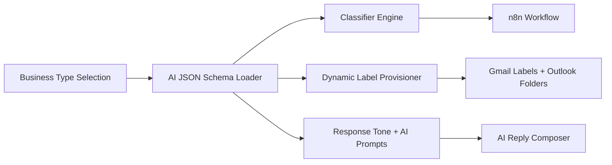

# AI JSON Schema System - Complete Implementation Guide

## 🎯 **Overview**

The AI JSON Schema System is a revolutionary architecture that makes Floworx truly modular and industry-specific. Each business type (Pools & Spas, Roofing, HVAC, etc.) gets its own **AI JSON definition** that contains everything the AI, Gmail automation, and onboarding flow need to know about that vertical.

## 🏗️ **Architecture**



**Every business type loads its own schema**, which feeds:
- The classifier (AI intent router)
- The Gmail/Outlook label provisioning system
- The n8n environment variable injection
- The AI tone, vocabulary, and escalation logic

## 📁 **Directory Structure**

```
src/
 └── businessSchemas/
      ├── ai-schema-template.json          # Master template
      ├── pools_spas.ai.json              # Pools & Spas schema
      ├── roofing_contractor.ai.json      # Roofing schema
      ├── hvac.ai.json                    # HVAC schema
      ├── electrician.ai.json             # Electrician schema
      ├── plumber.ai.json                 # Plumber schema
      ├── painting_contractor.ai.json     # Painting schema
      ├── flooring_contractor.ai.json     # Flooring schema
      ├── landscaping.ai.json             # Landscaping schema
      └── general_contractor.ai.json     # General Contractor schema
```

## 🧠 **What an AI JSON Schema Contains**

Each business type schema includes:

### 1. **Label Schema**
- Folder hierarchy, color, intents, critical labels
- Dynamic placeholders for managers/suppliers
- n8n environment variable mapping

### 2. **AI Intent Mapping**
- Which label each AI intent routes to
- Custom prompt and classification rules
- Confidence thresholds and fallback logic

### 3. **Keyword Vocabulary**
- Industry-specific keywords for fast routing
- Emergency, service, financial, warranty keywords
- Negative sentiment indicators

### 4. **Tone & Style Guide**
- How AI replies should sound
- Industry-specific response patterns
- Escalation and urgency handling

### 5. **Response and Escalation Logic**
- Who gets notified (manager, support, vendor)
- SLA targets (e.g. urgent replies in <10 min)
- Auto-reply vs manual handling rules

## 🚀 **Implementation**

### **Step 1: Load Business Schema**

```javascript
import { loadBusinessSchema } from './src/lib/aiJsonSchemaLoader.js';

// Load schema for any business type
const schema = await loadBusinessSchema('pools_spas');
console.log(schema.businessType); // "Pools & Spas"
console.log(schema.metadata.industry); // "Pool & Spa Services"
```

### **Step 2: Dynamic Label Provisioning**

```javascript
import { createProvisioningManager } from './src/lib/dynamicLabelProvisioningManager.js';

// Create provisioning manager for any business type
const manager = await createProvisioningManager('roofing_contractor');

// Get label schema
const labelSchema = manager.getLabelSchema();
const criticalLabels = manager.getCriticalLabels();
const provisioningOrder = manager.getProvisioningOrder();

// Generate n8n environment variables
const labelMap = { 'SERVICE': 'Label_123', 'BANKING': 'Label_456' };
const envVars = manager.generateN8nEnvironmentVariables(labelMap);
```

### **Step 3: AI Classification**

```javascript
// Get AI configuration
const aiConfig = manager.getAIConfiguration();
const intentMapping = manager.getIntentMapping();
const keywords = manager.getKeywords();

// Use for AI classification
const classificationResult = await classifyEmail(emailContent, {
  model: aiConfig.classificationModel,
  confidenceThreshold: aiConfig.confidenceThreshold,
  intentMapping: intentMapping,
  keywords: keywords
});
```

### **Step 4: Dynamic Response Generation**

```javascript
// Get AI prompts
const aiPrompts = manager.getAIPrompts();

// Generate response using business-specific prompts
const response = await generateResponse(emailContent, {
  systemMessage: aiPrompts.systemMessage,
  replyPrompt: aiPrompts.replyPrompt,
  classificationRules: aiPrompts.classificationRules
});
```

## 📋 **Schema Structure**

### **Core Schema Fields**

```json
{
  "schemaVersion": "1.0.0",
  "businessType": "Pools & Spas",
  "displayName": "Pools & Spas Business",
  "description": "AI JSON schema for Pools & Spas businesses...",
  
  "metadata": {
    "industry": "Pool & Spa Services",
    "primaryServices": ["Hot Tub Sales", "Spa Repairs", "Water Care"],
    "targetCustomers": ["Residential", "Commercial"],
    "seasonality": "Year-round with peak in spring/summer",
    "emergencyServices": true,
    "warrantyServices": true,
    "supplierDependent": true
  },

  "aiConfiguration": {
    "toneProfile": {
      "primary": "Friendly and professional",
      "secondary": "Warm and helpful",
      "emergency": "Urgent and reassuring",
      "sales": "Enthusiastic and consultative"
    },
    "classificationModel": "gpt-4o-mini",
    "confidenceThreshold": 0.8,
    "fallbackLabel": "MISC"
  },

  "intentMapping": {
    "ai.service_request": "SERVICE",
    "ai.financial_transaction": "BANKING",
    "ai.emergency_request": "URGENT",
    "ai.warranty_claim": "WARRANTY"
  },

  "keywords": {
    "primary": ["hot tub", "spa", "jacuzzi", "pool"],
    "secondary": ["water care", "chemicals", "maintenance"],
    "emergency": ["urgent", "emergency", "leak", "not working"],
    "service": ["repair", "install", "maintenance", "water care"],
    "financial": ["invoice", "payment", "quote", "estimate"],
    "warranty": ["warranty", "claim", "defect", "replacement"],
    "negative": ["problem", "issue", "broken", "not working"]
  },

  "labelSchema": {
    "colors": {
      "BANKING": { "backgroundColor": "#16a766", "textColor": "#ffffff" },
      "SERVICE": { "backgroundColor": "#4a86e8", "textColor": "#ffffff" },
      "URGENT": { "backgroundColor": "#fb4c2f", "textColor": "#ffffff" }
    },
    
    "labels": {
      "SERVICE": {
        "color": "SERVICE",
        "sub": ["Repairs", "Installations", "Maintenance", "Water Care Visits"],
        "nested": {
          "Repairs": ["Pump Repairs", "Heater Repairs", "Filter Repairs"]
        },
        "intent": "ai.service_request",
        "critical": true,
        "description": "All service operations including repairs and maintenance",
        "n8nEnvVar": "LABEL_SERVICE"
      }
    },
    
    "provisioningOrder": ["BANKING", "SERVICE", "URGENT", "WARRANTY"],
    "categoryGroups": {
      "Operations": ["SERVICE", "SUPPORT", "WARRANTY"],
      "Sales": ["SALES", "PROMO"],
      "Critical": ["URGENT"]
    }
  },

  "dynamicVariables": {
    "managers": [
      { "name": "Hailey", "email": "hailey@business.com", "role": "General Manager" },
      { "name": "Jillian", "email": "jillian@business.com", "role": "Operations Manager" }
    ],
    "suppliers": [
      { "name": "AquaSpaPoolSupply", "email": "orders@aquaspapoolsupply.com", "category": "Pool Equipment" },
      { "name": "StrongSpas", "email": "orders@strongspas.com", "category": "Spa Equipment" }
    ],
    "technicians": [
      { "name": "Tech1", "email": "tech1@business.com", "specialties": ["Spa Repairs", "Installations"] }
    ]
  },

  "escalationRules": {
    "urgent": {
      "threshold": "immediate",
      "notify": ["managers", "on_call_technician"],
      "sla": "15 minutes",
      "autoReply": true
    },
    "service": {
      "threshold": "2 hours",
      "notify": ["dispatcher"],
      "sla": "1 hour",
      "autoReply": true
    }
  },

  "aiPrompts": {
    "systemMessage": "You are an expert email processing and routing system for {{BUSINESS_NAME}}...",
    "replyPrompt": "Assistant role: Draft friendly, professional, and helpful replies...",
    "classificationRules": [
      "Identify urgent keywords (leak, emergency, not working) and route to URGENT label",
      "Recognize service requests (repair, maintenance, water care) and route to SERVICE label"
    ]
  },

  "environmentVariables": {
    "required": ["BUSINESS_NAME", "BUSINESS_PHONE", "BUSINESS_DOMAIN_PRIMARY"],
    "optional": ["BUSINESS_DOMAIN_SECONDARY", "SERVICE_AREA_PRIMARY"],
    "pricing": ["PRICE_SITE_INSPECTION", "PRICE_LABOUR_HOURLY"]
  }
}
```

## 🔧 **Usage Examples**

### **Example 1: Pools & Spas Business**

```javascript
// Load pools & spas schema
const poolsSchema = await loadBusinessSchema('pools_spas');

// Get industry-specific keywords
const keywords = poolsSchema.keywords;
// keywords.primary = ["hot tub", "spa", "jacuzzi", "pool"]
// keywords.emergency = ["urgent", "emergency", "leak", "not working"]

// Get service-specific labels
const serviceLabels = poolsSchema.labelSchema.labels.SERVICE.sub;
// serviceLabels = ["Repairs", "Installations", "Maintenance", "Water Care Visits"]

// Get supplier-specific sublabels
const supplierLabels = poolsSchema.labelSchema.labels.SUPPLIERS.sub;
// supplierLabels = ["AquaSpaPoolSupply", "StrongSpas", "WaterwayPlastics"]
```

### **Example 2: Roofing Contractor Business**

```javascript
// Load roofing contractor schema
const roofingSchema = await loadBusinessSchema('roofing_contractor');

// Get roofing-specific keywords
const keywords = roofingSchema.keywords;
// keywords.primary = ["roof", "shingle", "gutter", "leak", "storm damage"]
// keywords.emergency = ["urgent", "emergency", "leak", "storm", "damage"]

// Get roofing-specific service labels
const serviceLabels = roofingSchema.labelSchema.labels.SERVICE.sub;
// serviceLabels = ["Repairs", "Installations", "Storm Damage", "Inspections", "Gutter Services"]

// Get storm damage specific sublabels
const stormDamageLabels = roofingSchema.labelSchema.labels.SERVICE.nested["Storm Damage"];
// stormDamageLabels = ["Hail Damage", "Wind Damage", "Tree Damage", "Insurance Claims"]
```

### **Example 3: HVAC Business**

```javascript
// Load HVAC schema
const hvacSchema = await loadBusinessSchema('hvac');

// Get HVAC-specific keywords
const keywords = hvacSchema.keywords;
// keywords.primary = ["hvac", "heating", "cooling", "air conditioning", "furnace"]
// keywords.emergency = ["urgent", "emergency", "not working", "no heat", "no cooling"]

// Get HVAC-specific service labels
const serviceLabels = hvacSchema.labelSchema.labels.SERVICE.sub;
// serviceLabels = ["Heating Repairs", "Cooling Repairs", "Installations", "Maintenance", "Ductwork"]

// Get heating repair specific sublabels
const heatingRepairLabels = hvacSchema.labelSchema.labels.SERVICE.nested["Heating Repairs"];
// heatingRepairLabels = ["Furnace Repairs", "Heat Pump Repairs", "Boiler Repairs", "Thermostat Repairs"]
```

## 🧪 **Testing**

Run the comprehensive test suite:

```bash
node test-ai-json-schema-system.js
```

The test suite covers:
- Schema loader functionality
- Business type schema validation
- Dynamic label provisioning
- Integration scenarios
- Cross-business type consistency

## 🎯 **Benefits**

| Benefit | Description |
|---------|-------------|
| 🧩 **Modular** | Each industry can evolve independently |
| 🧠 **AI Accuracy** | Classifier learns vocabulary, tone, and routing for each trade |
| 🛠️ **Automation Mapping** | n8n workflows read label and intent mappings directly from schema |
| 🌍 **Multi-Tenant Ready** | Each client deployment uses the template for their industry type |
| ⚙️ **Dynamic Provisioning** | Schema drives label creation automatically |
| 💬 **Consistent AI Replies** | Tone and context tuned per industry |

## 🔄 **In Practice**

When a new user completes onboarding:

1. They select *"Roofing Contractor"* in Step 3
2. Floworx loads `/businessSchemas/roofing_contractor.ai.json`
3. Gmail labels + AI classifier + n8n workflow are generated dynamically
4. Managers/suppliers from onboarding replace placeholders
5. AI begins classifying and replying in context for that trade

## 📚 **API Reference**

### **AIJsonSchemaLoader**

```javascript
// Load schema
const schema = await schemaLoader.loadSchema('business_type');

// Get metadata
const metadata = await schemaLoader.getBusinessTypeMetadata('business_type');

// Get AI configuration
const config = await schemaLoader.getAIConfiguration('business_type');

// Get intent mapping
const mapping = await schemaLoader.getIntentMapping('business_type');

// Get keywords
const keywords = await schemaLoader.getKeywords('business_type');

// Get label schema
const labelSchema = await schemaLoader.getLabelSchema('business_type');

// Generate n8n environment variables
const envVars = await schemaLoader.generateN8nEnvironmentVariables('business_type', labelMap);
```

### **DynamicLabelProvisioningManager**

```javascript
// Create manager
const manager = await createProvisioningManager('business_type');

// Get label information
const labelSchema = manager.getLabelSchema();
const criticalLabels = manager.getCriticalLabels();
const provisioningOrder = manager.getProvisioningOrder();

// Get labels by criteria
const serviceLabels = manager.getLabelsByIntent('ai.service_request');
const subLabels = manager.getSubLabels('SERVICE');
const nestedLabels = manager.getNestedLabels('SERVICE', 'Repairs');

// Generate environment variables
const envVars = manager.generateN8nEnvironmentVariables(labelMap);

// Get statistics and validation
const stats = manager.getSchemaStatistics();
const validation = manager.validateSchemaIntegrity();
```

## 🚀 **Next Steps**

1. **Integrate with Onboarding Flow**: Update Step 3 to use the schema loader
2. **Update Label Provisioning**: Replace static pools_spas system with dynamic system
3. **Update AI Classification**: Use business-specific keywords and intents
4. **Update n8n Workflows**: Use dynamic environment variable generation
5. **Add New Business Types**: Create additional schemas as needed

## 📝 **Schema Validation**

Each schema is validated for:
- Required fields presence
- Intent mapping consistency
- Label schema integrity
- Environment variable uniqueness
- Color validation (Gmail API allowed colors)

## 🔧 **Customization**

To add a new business type:

1. Create new schema file in `src/businessSchemas/`
2. Add to `BUSINESS_TYPE_REGISTRY` in `aiJsonSchemaLoader.js`
3. Follow the template structure
4. Test with the test suite
5. Update onboarding flow to include new option

---

**The AI JSON Schema System transforms Floworx from a single-purpose tool into a truly modular, industry-agnostic automation platform. Each business type gets its own intelligence pack, making the system infinitely scalable and customizable.**
