# 🧭 Complete Data Flow Pipeline - Visual Diagram

## Mermaid Flow Diagram

```mermaid
flowchart TD
    A[🧭 Onboarding Wizard<br/>React/Vue Web App] -->|Collects business data| B[📄 Business Profile JSON<br/>/jsons/business/{id}.json]
    
    B --> C[🤖 AI Behavior Generator<br/>Module]
    B --> D[🏷️ Label Schema Generator<br/>Module]
    
    C -->|Loads industry template<br/>+ applies customizations| E[📋 Behavior JSON<br/>/jsons/behavior/{industry}.json]
    D -->|Loads industry template<br/>+ applies team/supplier data| F[🏷️ Label Schema JSON<br/>/jsons/labels/{industry}.json]
    
    E --> G[⚙️ Config Compiler<br/>Module]
    F --> G
    B --> G
    
    G -->|Merges all configs<br/>into unified JSON| H[📦 Compiled Config JSON<br/>/jsons/compiled/{id}_compiled.json]
    
    H --> I[🔑 Credential Setup<br/>OAuth Handler]
    I -->|Stores Gmail/Outlook<br/>credentials| J[🔐 Credentials Stored<br/>in compiled config]
    
    J --> K[🧩 n8n Workflow Builder<br/>Module]
    K -->|Injects configs into<br/>workflow template| L[💾 Final n8n.json Export<br/>/exports/{id}/n8n.workflow.json]
    
    L --> M[🚀 Deployment Stage]
    M -->|Option A: Auto-upload| N[📤 n8n API Upload<br/>POST /rest/workflows]
    M -->|Option B: Download link| O[🔗 User Dashboard<br/>Download & Import]
    
    N --> P[✅ Production n8n Workflow<br/>Active & Running]
    O --> P
    
    %% Styling
    classDef onboarding fill:#e1f5fe,stroke:#01579b,stroke-width:2px
    classDef processing fill:#f3e5f5,stroke:#4a148c,stroke-width:2px
    classDef output fill:#e8f5e8,stroke:#1b5e20,stroke-width:2px
    classDef deployment fill:#fff3e0,stroke:#e65100,stroke-width:2px
    
    class A onboarding
    class B,C,D,E,F,G,H,I,J,K processing
    class L output
    class M,N,O,P deployment
```

## Detailed Process Flow


## Data Transformation Flow


## Industry-Specific Flow

```mermaid
flowchart TD
    subgraph "Industry Templates"
        IT1[🏷️ Label Template<br/>_template.json]
        IT2[🤖 Behavior Template<br/>_template.json]
    end
    
    subgraph "Industry Configurations"
        IC1[🏷️ Pools & Spas<br/>pools_spas.json]
        IC2[🏷️ HVAC<br/>hvac.json]
        IC3[🏷️ Roofing<br/>roofing.json]
        IC4[🏷️ Landscaping<br/>landscaping.json]
        IC5[🏷️ Painting<br/>painting.json]
        
        IB1[🤖 Pools & Spas<br/>pools_spas.json]
        IB2[🤖 HVAC<br/>hvac.json]
        IB3[🤖 Roofing<br/>roofing.json]
        IB4[🤖 Landscaping<br/>landscaping.json]
        IB5[🤖 Painting<br/>painting.json]
    end
    
    subgraph "Business Selection"
        BS[User selects<br/>Industry Type]
    end
    
    BS --> IC1
    BS --> IC2
    BS --> IC3
    BS --> IC4
    BS --> IC5
    
    BS --> IB1
    BS --> IB2
    BS --> IB3
    BS --> IB4
    BS --> IB5
    
    IT1 -.->|Extends| IC1
    IT1 -.->|Extends| IC2
    IT1 -.->|Extends| IC3
    IT1 -.->|Extends| IC4
    IT1 -.->|Extends| IC5
    
    IT2 -.->|Extends| IB1
    IT2 -.->|Extends| IB2
    IT2 -.->|Extends| IB3
    IT2 -.->|Extends| IB4
    IT2 -.->|Extends| IB5
```



## File Structure Visualization

```mermaid
graph TD
    subgraph "Source Files"
        SF1[src/behaviorSchemas/<br/>Industry behavior JSONs]
        SF2[src/labelSchemas/<br/>Industry label JSONs]
        SF3[src/lib/<br/>Core modules]
        SF4[src/scripts/<br/>Validation scripts]
    end
    
    subgraph "Generated Files"
        GF1[jsons/business/<br/>Business profiles]
        GF2[jsons/behavior/<br/>Generated behaviors]
        GF3[jsons/labels/<br/>Generated labels]
        GF4[jsons/compiled/<br/>Compiled configs]
    end
    
    subgraph "Exports"
        EX1[exports/{id}/<br/>n8n.workflow.json]
    end
    
    SF1 --> GF2
    SF2 --> GF3
    SF3 --> GF1
    SF4 --> GF1
    
    GF1 --> GF4
    GF2 --> GF4
    GF3 --> GF4
    
    GF4 --> EX1
```

## Validation Flow

```mermaid
flowchart TD
    subgraph "Validation Stages"
        V1[📋 Schema Validation<br/>validate-behavior-json.ts]
        V2[🏷️ Label Validation<br/>validate-label-schema.ts]
        V3[⚙️ Config Validation<br/>validate-compiled-config.ts]
        V4[🧩 Workflow Validation<br/>validate-n8n-workflow.ts]
    end
    
    subgraph "Validation Results"
        VR1[✅ Valid Config]
        VR2[❌ Invalid Config<br/>+ Error Details]
    end
    
    V1 --> VR1
    V1 --> VR2
    V2 --> VR1
    V2 --> VR2
    V3 --> VR1
    V3 --> VR2
    V4 --> VR1
    V4 --> VR2
    
    VR2 --> V1
```



## Deployment Options

```mermaid
flowchart TD
    subgraph "Deployment Options"
        DO1[🚀 Auto-Upload to n8n<br/>via API]
        DO2[🔗 Download Link<br/>User Dashboard]
        DO3[📧 Email Export<br/>Send to User]
    end
    
    subgraph "Deployment Process"
        DP1[Generate n8n.json]
        DP2[Validate Workflow]
        DP3[Create Credentials]
        DP4[Upload to n8n]
        DP5[Activate Workflow]
    end
    
    subgraph "User Actions"
        UA1[Download File]
        UA2[Import to n8n]
        UA3[Configure Credentials]
        UA4[Activate Workflow]
    end
    
    DP1 --> DP2
    DP2 --> DP3
    DP3 --> DP4
    DP4 --> DP5
    
    DP1 --> DO1
    DP1 --> DO2
    DP1 --> DO3
    
    DO1 --> DP4
    DO2 --> UA1
    DO3 --> UA1
    
    UA1 --> UA2
    UA2 --> UA3
    UA3 --> UA4
```



## Error Handling Flow

```mermaid
flowchart TD
    subgraph "Error Detection"
        ED1[❌ Schema Validation Error]
        ED2[❌ Config Compilation Error]
        ED3[❌ Credential Setup Error]
        ED4[❌ Workflow Generation Error]
        ED5[❌ Deployment Error]
    end
    
    subgraph "Error Handling"
        EH1[🔄 Rollback Changes]
        EH2[📝 Log Error Details]
        EH3[📧 Notify User]
        EH4[🛠️ Suggest Fixes]
        EH5[🔁 Retry Operation]
    end
    
    subgraph "Recovery Actions"
        RA1[Restore Previous Config]
        RA2[Regenerate Failed Component]
        RA3[Manual Intervention Required]
        RA4[Contact Support]
    end
    
    ED1 --> EH1
    ED2 --> EH1
    ED3 --> EH1
    ED4 --> EH1
    ED5 --> EH1
    
    EH1 --> EH2
    EH2 --> EH3
    EH3 --> EH4
    EH4 --> EH5
    
    EH5 --> RA1
    EH5 --> RA2
    EH5 --> RA3
    EH5 --> RA4
```



This comprehensive visual representation shows the complete data flow pipeline from user onboarding to production n8n workflow deployment, including all processing stages, validation flows, deployment options, and error handling mechanisms.
