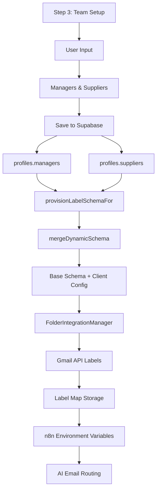

# 🎯 **Dynamic Label Provisioning Flow: Step 3 → Gmail Labels**

## 📋 **Complete Flow Overview**



---

## 🔄 **Step-by-Step Process**

### **1. User Input (Step 3 UI)**
```javascript
// User enters in Step 3 Team Setup:
Managers:
- Manager1 (manager@gmail.com)
- Hailey (hailey@company.com)
- Jillian (jillian@company.com)

Suppliers:
- Strong Spas (strong9.com)
- AquaSpaPoolSupply (aquaspapoolsupply.com)
- ParadisePatioFurnitureLtd (paradisepatio.com)
- WaterwayPlastics (waterwayplastics.com)
```

### **2. Data Storage (Supabase)**
```json
{
  "profiles": {
    "managers": [
      { "name": "Manager1", "email": "manager@gmail.com" },
      { "name": "Hailey", "email": "hailey@company.com" },
      { "name": "Jillian", "email": "jillian@company.com" }
    ],
    "suppliers": [
      { "name": "Strong Spas", "domains": ["strong9.com"] },
      { "name": "AquaSpaPoolSupply", "domains": ["aquaspapoolsupply.com"] },
      { "name": "ParadisePatioFurnitureLtd", "domains": ["paradisepatio.com"] },
      { "name": "WaterwayPlastics", "domains": ["waterwayplastics.com"] }
    ]
  }
}
```

### **3. Schema Merging (Dynamic)**
```javascript
// Base Schema (Pools & Spas)
const baseSchema = {
  "MANAGER": {
    "sub": ["Unassigned", "Escalations", "Manager Review"]
  },
  "SUPPLIERS": {
    "sub": ["AquaSpaPoolSupply", "ParadisePatioFurnitureLtd", "StrongSpas"]
  }
};

// After mergeDynamicSchema()
const mergedSchema = {
  "MANAGER": {
    "sub": ["Unassigned", "Escalations", "Manager Review", "Manager1", "Hailey", "Jillian"]
  },
  "SUPPLIERS": {
    "sub": ["AquaSpaPoolSupply", "ParadisePatioFurnitureLtd", "StrongSpas", "Strong Spas", "AquaSpaPoolSupply", "ParadisePatioFurnitureLtd", "WaterwayPlastics"]
  }
};
```

### **4. Gmail Label Creation**
```
SUPPLIERS/
├── Strong Spas
├── AquaSpaPoolSupply
├── ParadisePatioFurnitureLtd
├── WaterwayPlastics
├── StrongSpas (from base)
└── AquaSpaPoolSupply (from base)

MANAGER/
├── Manager1
├── Hailey
├── Jillian
├── Unassigned (from base)
├── Escalations (from base)
└── Manager Review (from base)
```

### **5. n8n Environment Variables**
```javascript
{
  "LABEL_MANAGER_MANAGER1": "Label_1234567890",
  "LABEL_MANAGER_HAILEY": "Label_1234567891",
  "LABEL_MANAGER_JILLIAN": "Label_1234567892",
  "LABEL_SUPPLIERS_STRONG_SPAS": "Label_1234567893",
  "LABEL_SUPPLIERS_AQUASPAPOOLSUPPLY": "Label_1234567894",
  "LABEL_SUPPLIERS_PARADISEPATIOFURNITURELTD": "Label_1234567895",
  "LABEL_SUPPLIERS_WATERWAYPLASTICS": "Label_1234567896"
}
```

---

## 🧠 **AI Email Routing Logic**

### **Manager Routing**
```javascript
// Email from manager@gmail.com → MANAGER/Manager1
// Email from hailey@company.com → MANAGER/Hailey
// Email from jillian@company.com → MANAGER/Jillian
```

### **Supplier Classification**
```javascript
// Email from @strong9.com → SUPPLIERS/Strong Spas
// Email from @aquaspapoolsupply.com → SUPPLIERS/AquaSpaPoolSupply
// Email from @paradisepatio.com → SUPPLIERS/ParadisePatioFurnitureLtd
// Email from @waterwayplastics.com → SUPPLIERS/WaterwayPlastics
```

---

## 🔧 **Technical Implementation**

### **mergeDynamicSchema Function**
```javascript
function mergeDynamicSchema(baseSchema, clientConfig) {
  const schema = structuredClone(baseSchema);

  // Merge managers
  if (clientConfig.managers?.length > 0) {
    const managerNames = clientConfig.managers
      .filter(m => m.name && m.name.trim() !== '')
      .map(m => m.name.trim());
    
    if (managerNames.length > 0) {
      const existingSubs = schema.MANAGER.sub || [];
      schema.MANAGER.sub = [...new Set([...existingSubs, ...managerNames])];
    }
  }

  // Merge suppliers
  if (clientConfig.suppliers?.length > 0) {
    const supplierNames = clientConfig.suppliers
      .filter(s => s.name && s.name.trim() !== '')
      .map(s => s.name.trim());
    
    if (supplierNames.length > 0) {
      const existingSubs = schema.SUPPLIERS.sub || [];
      schema.SUPPLIERS.sub = [...new Set([...existingSubs, ...supplierNames])];
    }
  }

  return schema;
}
```

### **Step 4 Integration**
```javascript
// In StepTeamSetup.jsx handleContinue()
const provisioningResult = await provisionLabelSchemaFor(user.id, businessType);

if (provisioningResult.success) {
  toast({ 
    title: 'Labels Created Successfully!', 
    description: `Created ${provisioningResult.totalLabels} email labels including ${finalManagers.length} manager routes and ${finalSuppliers.length} supplier categories.` 
  });
}
```

---

## 🎯 **Benefits Achieved**

| **Aspect** | **Before** | **After** |
|------------|------------|-----------|
| **Label Source** | Static business schema | Dynamic team configuration |
| **Manager Routing** | Generic "Manager" label | Individual manager labels |
| **Supplier Classification** | Template suppliers only | User-defined suppliers |
| **User Experience** | Delayed feedback | Immediate visual confirmation |
| **AI Accuracy** | Generic routing | Precise team-based routing |
| **Scalability** | Fixed structure | Grows with team size |

---

## 🧪 **Testing**

Run the test script to verify the complete flow:

```javascript
// In browser console
testDynamicSchemaMerging();
```

This will test:
- ✅ Schema merging logic
- ✅ Manager label creation
- ✅ Supplier label creation
- ✅ Dynamic provisioning
- ✅ n8n environment variables
- ✅ Complete Step 3 → Label flow

---

## 🎉 **Result**

**Perfect integration!** Step 3 Team Setup now dynamically powers the entire label provisioning system, creating personalized Gmail labels based on the user's actual team configuration. This creates a seamless, data-driven onboarding experience that scales with the business.
